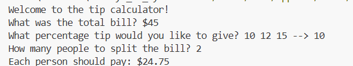

## 💰 Tip Calculator – Python

- A simple Python program that calculates how much each person should pay after splitting a bill, including a tip.

- This project is part of my 100 Days of Python learning journey.

---

##  What It Does

- Takes the total bill amount

- Asks for the tip percentage

- Asks how many people are splitting the bill

- Calculates and displays the amount each person should pay

---

##  How to Run

`python app.py`

---

##  Concepts Used

- User input with input()

- Type conversion (int, float)

- Basic arithmetic operations

- Rounding numbers
  
---

## Final Output Image

---

##  Author

Muskan Tamang
Student | Learning Python

---
