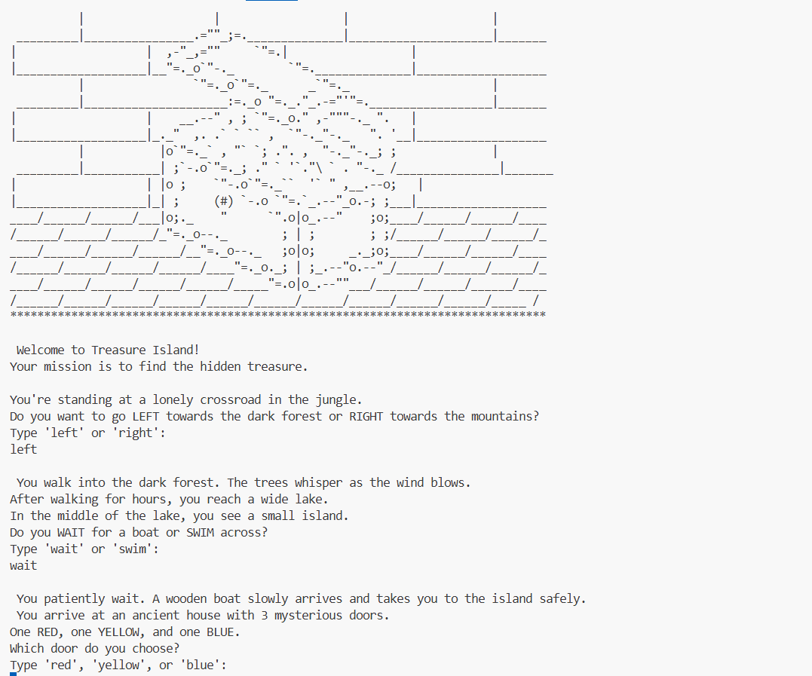

# 🏝️ Treasure Island – Python Text Adventure

A fun text-based adventure game built using Python, where the player makes choices to find a hidden treasure.
Each decision leads to a different outcome — win or game over!

This project is part of my 100 Days of Python learning journey.

---

## Game Objective

- Navigate through a jungle adventure

- Make the right choices at each stage

- Find the hidden treasure without losing the game

---

##  How the Game Works

The game starts with an ASCII art introduction.

The player is asked to make choices by typing words like:

- left / right

- wait / swim

- red / yellow / blue

Based on the choices, the story progresses or ends.

---

## How to Run the Game

Make sure Python is installed, then run:

python app.py

---

## Concepts Used

print() statements

input() for user interaction

Conditional statements (if, elif, else)

String methods (.lower())

Nested decision logic

ASCII art in Python

---

## Final Output Image

---

##  Author

Muskan Tamang
Student | Learning Python
Part of 100 Days of Python

---
