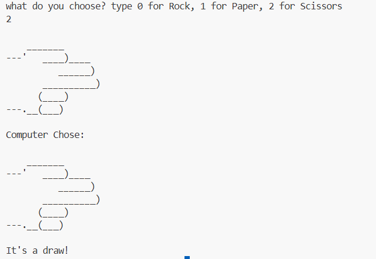

## ✊✋✌️ Rock Paper Scissors – Python Game

A simple Python Rock Paper Scissors game where the player competes against the computer using random choices.

This project is part of my 100 Days of Python learning journey.

---

## 🎮 How to Play

Type:

- 0 for Rock

- 1 for Paper

- 2 for Scissors

The computer randomly chooses its move.

The winner is decided based on the game rules.

---

## 🧠 Concepts Used

- random module

- Lists

- Conditional statements (if / elif / else)

- User input handling

---

## ▶️ How to Run
python app.py

---

## 📌 Learning Purpose

This project helped me practice:

- Random number generation

- Game logic

- User input validation

---
## Final Output Image

---

# 👤 Author

Muskan Tamang
Student | Learning Python

---