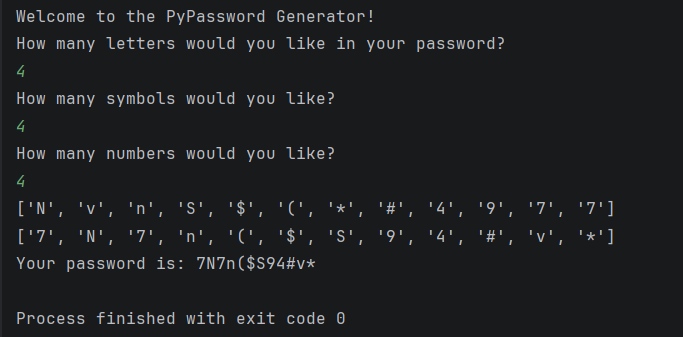

### 🔐 PyPassword Generator – Python

A Python program that generates a random and secure password based on user preferences for letters, numbers, and symbols.

This project is part of my 100 Days of Python learning journey.

---

### What It Does

- Asks how many letters, symbols, and numbers you want

- Randomly selects characters from each category

- Shuffles the characters to improve security

- Generates a final password

---

###  How to Run

Make sure Python is installed, then run:

`python app.py`

---

### Concepts Used

random.choice()

random.shuffle()

Lists

Loops (for)

User input handling

String concatenation

---

###  Example Output

`Your password is: aB3#9k$P`

---

### Learning Purpose

This project helped me practice:

Working with lists

Generating random values

Building secure strings

Combining logic step-by-step

---

## Final Output Image

---

###  Author

Muskan Tamang
Student | Learning Python

---
